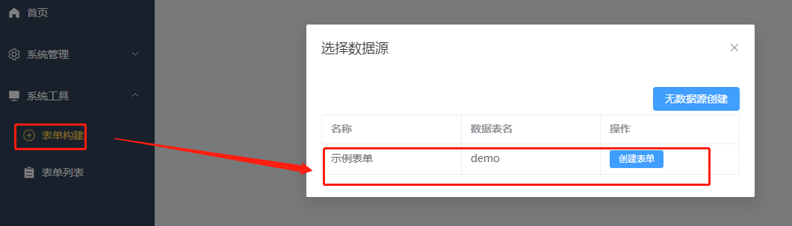
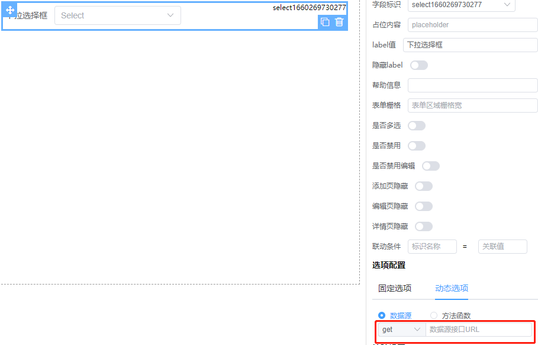

# 接口文档说明

## 1.获取可用于创建表单的数据源

接口地址如：http://xxxx.com/api/getdatasource

请求类型：get/post

请求参数：无

返回结果：

```json
 {
  "code": 200,
  "data": [
    {
      "name": "示例表单",
      "id": "1"
    }
  ]
}
```

调用位置截图：

## 2.根据表单id(接口1 id)获取表单提交字段

接口地址如：http://xxxx.com/api/getformFiled

请求类型：get/post

请求参数：

```json
{
  "id": "1"
}
```

返回结果：

```json
{
  "code": 200,
  "data": [
    {
      "name": "text",
      "label": "文本框"
    },
    {
      "name": "textarea",
      "label": "多行文本"
    },
    {
      "name": "radio",
      "label": "单选框组"
    },
    {
      "name": "checkbox",
      "label": "多选框组测试"
    },
    {
      "name": "select",
      "label": "下拉选择框"
    }
  ]
}
```


## 7.添加/修改表单内容

接口地址如：http://xxxx.com/api/saveformcontent

请求类型:post

请求参数：

```json
{
  "tid": 1,
  "id": 1, // 当前记录id，新增时无
  "...": ""
  // 其他表单设计的所有字段
}
```

返回结果：

```json
{
  "code": 200,
  "data": "操作成功/操作失败"
}
```

## 8.根据id获取表单内容

接口地址如：http://xxxx.com/api/getformcontent

请求类型:post

请求参数：

```json
{
  "tid": 1,
  "id": 1
}
```

返回结果：

```json
{
  "code": 200,
  "data": {
    //返回接口7提交的所有字段
  }
}
```

## 9.删除表单内容（批量删除）

接口地址如：http://xxxx.com/api/delformcontent

请求类型:get/post

请求参数：

```json
{
  "tid": 1,
  "id": 1
}
```

返回结果：

```json
{
  "code": 200,
  "data": "删除成功/失败"
}
```

## 10.表单内容列表

接口地址如：http://xxxx.com/api/getcontentlist

请求类型:get/post

请求参数：

```json
{
  "tid": 1,
  "pageIndex": "当前第几页，数字",
  "pageSize": "每页多少条记录，数字"
}
```

返回结果：

```json
{
  "code": 200,
  "data": {
    "list": [
      {
        "formId": 1,
        "id": 1,
        "name": "示例测试"
      }
    ],
    "pageInfo": {
      "total": 100
    }
  }
}
```

## 11.提供表单单选/多选/下拉/级联等下拉选项的数据（可不提供）

接口地址如：http://xxxx.com/api/getoptions?a=x&b=x （仅支持url传参）

请求类型：get/post

请求参数：根据实际情况使用url传参

返回结果：

```json
{
  "code": 200,
  "data": [
    {
      "value": "1",
      "label": "选项1"
    },
    {
      "value": "2",
      "label": "选项2"
    }
  ]
}
```

调用位置截图：

## 12.图片/文件上传

接口地址如：http://xxxx.com/api/upload

请求类型：post

请求参数：formData数据

返回结果：

```json
{
  "code": 200,
  "data": "上传后的图片或文件路径"
}

```

注：为减少不必要的资源浪费，演示时可返回固定示例图片或文件即可

# 总结

需支持跨域请求

根据演示示例，可能需要如下数据表

## 表1：

用于保存已设计好的表单，接口3提交保存到此表；为接口4提供已保存的数据

### 表1必需字段

| 字段         | 说明                                          |
|------------|---------------------------------------------|
| id         | 当前记录id，可为自动生成                               |
| formId     | 表单数据源id，即使用了哪个数据源创建的表单，当表单新增数据时根据此id提交到对应的表 |
| name       | 创建的表单名称                                     |
| formData   | 设计的表单json字符串数据                              |
| searchData | 表单列表搜索表单字符串数据                               |
| tableData  | 表单列表字符串数据                                   |

## 表2

用作本次演示的数据表，每张表对应一个表单数据。为接口2提供当前所有可供数据录入的字段；为接口1提供可用于设计的表单数据源

## 表2演示字段

| 字段  | 说明              |
|-----|-----------------|
| 文本框 | 表单提交的字段         |
| 多选框 | 同上              |
| 单选  | 同上              |
| 多选  | 同上              |
| ... | 可提供所有可设计的字段用于测试 |
