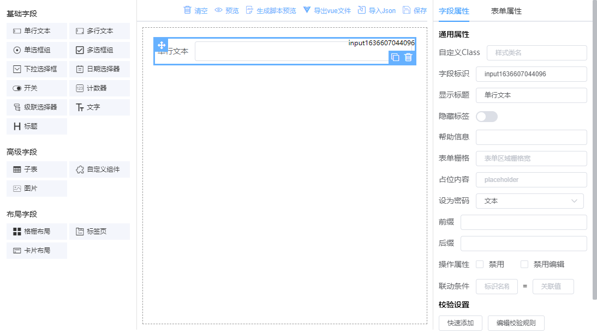

# 目录结构

```text
nodejs // 模拟后端接口
public
 ├─mock // 模拟数据
 ├─static  // 静态资源
   ├─ iconfont icon图标
   └─ plugins 表单设计编辑器及富文本编辑器相关js
src
 ├─api // 数据请求接口
 ├─docs // 使用说明文档
 └─views // 页面
   ├─designForm // 表单设计主程序组件
     ├─components // 核心组件
     ├─form.vue // 通用表单新增/编辑页
     ├─formList.vue // 已设计表单列表页
     ├─index.vue // 表单设计主页面
     ├─list.vue // 通用表单内容列表页
     └─table.vue // 列表页设计主页面
   └─export
     ├─form.vue // 添加编辑表单文件，在表单设计处导出的vue文件，用作测试
     └─list.vue // 表单列表文件，在表单设计处导出的vue文件，用作测试
```

# 快速上手

进入项目安装依赖包

```text
git clone https://github.com/337547038/vue-form-design.git
yarn install
yarn run dev
```

# nodejs模拟接口

体验完整的流程可启动nodejs模拟接口数据，使用mock/json数据只能查看；

先将`/nodejs/akform.sql`导入到mysql数据库里，在db.js里修改数据库连接配置

进入nodejs目录安装依赖

```text
yarn install
yarn dev
```

浏览器进入 http://localhost:3000 开始创建表单



# 代码编辑支持json和javascript两种模式

代码编辑输入框可支持`json`或`javascript`，初始使用时可通过修改`/src/utils/form.ts`里的`EDITTYPE`的值

# 如何整合到已有项目

最近有不少同学都在问如何使用，怎么整合到自己的项目当中。

首先不建设打包发npm之类的，因该系统包含了完整的表单设计、列表设计、列表条件查询设计、表单设计增加修改、设计列表内容增删查改等功能及各页面之间路由跳转。

复制以下文件到你项目下：

复制`/public/staic`， 在index.html引入，可参考`/index.html`引入方式；

复制`/src/api`、`/src/store/designForm`、`/src/utils`、`/src/viesw/designForm`，引入方式可参考`/src/main.ts`，如：

```javascript
import AKDesignForm from './views/designForm/index'

const pinia = createPinia()
const app = createApp(App)
app.use(pinia).use(AKDesignForm).mount('#app')
```

最后做好路由指向，如:

```javascript
[
  {
    path: '/designform', // 主设计页
    name: 'designform',
    component: () => import('../views/designForm/index.vue')
  },
  {
    path:'/designform/table', // 列表设计页
    name:'designformTable',
    component: () => import('../views/designForm/table.vue')
  },
  {
    // ... 其他
  }
]
```

> 如果是新项目，建议在此框架基础上开发即可

