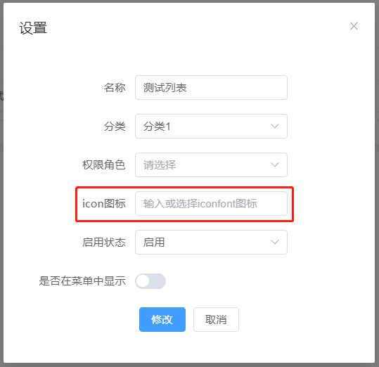
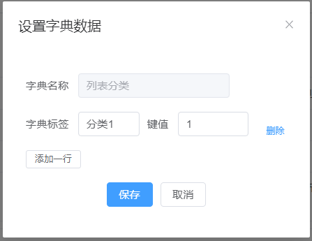
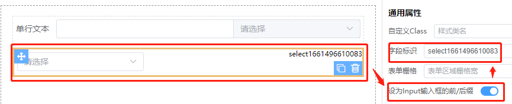
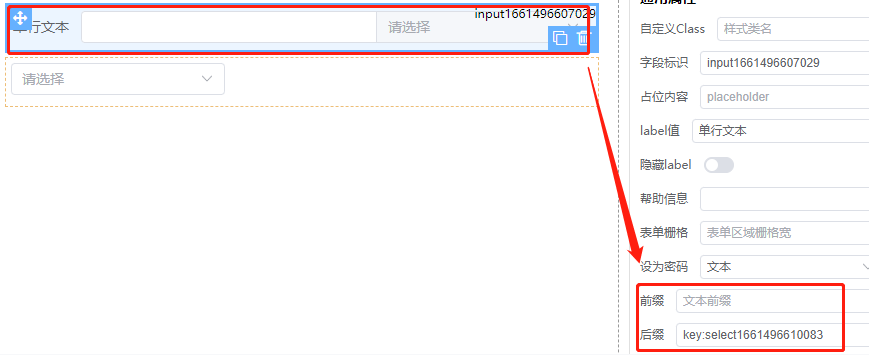

# 表单设计

## 基础字段

表单设计基本常用组件，直接拖动设计区域，设置好相应的属性配置即可，各组件使用见系统管理各栏目

**•树形控件**

使用方法详见[系统管理部门管理](/#/design/dataSource) 新增弹窗

## 高级字段

**•子表：**

使用方法详见[新增表单数据源](/#/design/dataSource)

**•自定义组件**

自定义组件需全局注册，`导出vue文件`使用可使用当前页面导入的。组件需要v-model才级实现更新

引入当前页面组件时建议使用markRaw，如：

```javascript
// import component from 'xxx.vue'
config: {
  componentName: markRaw(component)
}
```

使用方法详见：

[列表页设计管理](/#/design/dataList/list) 设置弹窗

[系统管理-角色管理](/#/system/role) 新增编辑角色菜单权限



## 布局字段

**•弹性布局**

使用方法详见[字典管理](/#/system/dict)



## 使用模板

可通用使用模板快速创建表单

**创建新模板**

src/views/design/form/template目录下新建ts文件，将设计生成的json/javascript代码复制保存即可新增模板，格式如下：

```javascript
export const imgPath = 'demo.png' // 预览图
export const title = '标题' // 标题
export const formData = {} // 生成的代码
```

## 预览

可快速查看当前设计的表单，样式和实际可能存在差异。

## 生成脚本预览

除了预览，同时可以修改编辑，支持更多参数

```text
{
  list:[
    type:'input',
    control:{
    // 这里对应的当前组件所有props参数，可见elementUi组件
  }
  ]
}
```

## 导出vue文件

支持更多个性化设置，可导出vue文件到本地目录，配置好路由即可。此方法更灵活。更多用法详见系统管理下所有栏目使用

## 保存

将设计生成的表单保存到服务端，也可通过`导出vue文件`单独使用

## 字段配置

### 通用属性

**•字段标识**

表单控件唯一标识，即表单控件元素的name值。在提交表单时根据此标识提交。如用户名标识为name，则提交表单为{name:'xx'}。其中get[formName]ControlByName(name)
中的name即为此标识，可快速根据此标识查找到当前组件。若不需提交表单和查找等，可为空

**•帮助信息**

用于对当前字段加以说明提示的帮助信息，会在label后面显示一个小问号，鼠标滑过提示。

**•设为Input输入框的前/后缀**

此功能可将select输入框作为input组件的前后缀使用。步骤：

1.选择select组件 => 设为Input输入框前/后缀为true => 复制当前字段标识，如下图



2.选择文本输入框设置前后缀为`key:粘贴前面复制的字段标识`，如下图



**•联动条件**

编写联动条件表达式，可使用&&和||等运算符，当满足条件时可将该组件设置为显示/隐藏或者是启用/禁用。其中`$`
表示当前表单的值。例如表单中有name=sex的单选值及name=age的文本输入，即当sex选中了1和age输入框的值大于20时条件成立

```text
$.sex===1&&$.age>20
```

### 选项配置

**1.固定选项**

即可选择的值为固定值，由前端页面在设计时固定，不能修改。点击`新增`按钮，输入标签和值即可，可添加多个

**2.数据源**

当前组件选项通过指定的URL来获取。URL可以为完整的地址，也可以是api里设定的key

**指定label/value属性值**

选项数据需要的数据格式为label/value值形式，很多时候接口返回的数据并不是我们想要的，如:

```javascript
// 接口返回为name/id形式时，可设置label="name",value="id"
const result =[{name:'name',id:'1'}]
// 转换后的数据
const format =[{label:'name',value:'1'}]
```
注意：设置了`afterResponse`时这三个参数无效

**尝试转换value数据类型**

当表单组件对应的值的数字时，这里回显则会异常，这时可以尝试将value转为string或number形式


可通过配置`beforeRequest`来添加指定请求参数配置，同时可使用`afterResponse`事件编辑方法对获取到的数据进行处理，最后再return回去。这两方法同表单配置的`beforeRequest`
和`afterResponse`。

```javascript
//　beforeRequest
opt = (data, route, form) => {
  // data表求的数据　route 页面路由信息　form当前表单值
  return data
}
```

当选择为数据源时，数据源接口URL optionsFun可带一个动态参数，如/api?id=${key}，key可以是当前表单任意name=key的组件，并且当该组件值发生改变时会重新请求；可实现联动功能，如：

```javascript
[
  {
    type: "select",
    control:
      {
        modelValue: "",
        appendToBody: true
      },
    options: [],
    config:
      {
        optionsType: 0
      },
    name: "province",
    item:
      {
        label: "省份"
      }
  },
  {
    type: "select",
    control:
      {
        modelValue: "",
        appendToBody: true
      },
    options: [],
    config:
      {
        optionsType: 1,
        optionsFun: "/api/getCity?id=${province}", // 当province组件改变时，重新请求。返回数据必须为[{label:'x',value:'xx'}]格式，否则需进行转换
        method: "get"
      },
    name: "city",
    item:
      {
        label: "城市"
      }
  }]
```

使用可见表单设计或列表设计页的权限角色[权限角色](/#/design/dataList/list)

**3.方法函数**

该方法适合于将当前表单`导出为vue文件`格式，通过在页面中编写代码将选项值传给当前组件。也可使用[setOptions](/#/docs/form)方法设置。在导出时会自动生成示例代码，如：

```javascript
provide('methodsName', {label: 'x', value: 'xx'})
```

**4.接口字典**

当复杂表单中存在大量需要配置选项的组件时，每个组件都从指定URL获取，这是不太现实的，一大堆的请求会让你怀疑人生不说，还浪费服务器资源。对此可以设计表单时预设一些固定的选项值或者在接口里返回。可以`表单配置-设置字典数据`配置

### 校验设置

**1.快速添加：**

1.可快速选择添加多个校验规则，输入对应提示语即可，非常简单方便。

2.自定义正则：则需要填写正则表达式

3.自定义方法：仅支持`导出vue文件`模式，如方法名称为myFn，在导出文件时则会生成示例代码，如:

```javascript
provide("myFn", (rule, value, callback) => {
  if (value === '') {
    callback(new Error('Please input the password again'))
  } else if (value !== 'abc') {
    callback(new Error("Two inputs don't match!"))
  } else {
    callback()
  }
})
```

4.除系统内置的校验规则，还可通过可./design/form/components/validate.ts扩展，添加常用校验规则

**2.编写校验规则：**
除了快速选择之外，还可以在弹出的窗口里通过编辑校验规则来实现，详情可参考UI组件的校验规则。可在弹出框输入代码，如：

```javascript
opt = [
  {required: true, message: 'age is required'},
  {type: 'number', message: 'age must be a number'}
]
```

*除input文本输入框外，其他可输入组件如select、checkbox只有必选项，输入对应提示语即可

### 其他属性

字段属性里只是列了一些比较常用的prop，如还需要其他属性，可通过添加属性窗口来编写，每个组件都有不同的prop，可参考UI当前组件prop

## 表单配置

**•表单名称**：保存时的名称

**•数据源**：

注意：此接口数据会缓存本地，防频繁请求加载

设计的表单提交数据保存时，默认根据选择的数据源保存在对应的mysql数据表中；可选择已有数据源，也可通过配置接口数据事件url，提交到指定的url；数据源创建可见 [使用手册－数据源](/#/docs/use-dataSource)

**•表单标识：**

当前表单唯一标识，get[formName]ControlByName和get[formName]ValueByName中的formName值，根据此标识查找。若都没使用以上方法则可留空

**•表单标签宽度：**

即FormItem的属性label-width

**•表单样式名称：**

为当前表单额外添加的css样式名，可用于个性化调整。对应样式可以是全局的，或者在编辑表单样式中输入

**•添加时获取请求：**

当表单添加新数据内容时可请求接口url，获取新增初始值以及所需字典数据等等

**•编辑表单样式：**

编写有样式时会在当前页面head中插入style脚本，作用范围为当前页面。类似于.vue文件中的style scoped中的样式。在弹出编辑框中可编写css样式

**•设置数据字典：**

当前表单的数据字典，可为单选多选和checkbox等提供初始选项。此类组件在选项配置时，只需设计 `动态选项－接口字典` 输入对应的key即可。字典配置格式如下：

```json
{
  "sex": {
    "0": "男",
    "1": "女"
  },
  "status": {
    "1": "启用",
    "0": "禁用"
  }
}
```

### 接口数据事件

**1.新增数据保存url：**

默认会根据所选数据源提交到对应的url，某些特殊情况或是作为`导出vue文件`单独使用时可设置，同props.addUrl。**这里设置优先于数据源**。

**2.修改数据保存url：**

同理于新增url，同props.editUrl

**3.获取表单数据url：**

同理于新增url，同props.requestUrl

**4.beforeRequest：**

在请求获取表单数据前事件，同props.beforeRequest，如：

```javascript
const beforeRequest = (params, route) => {
  // 此处可对请求参数params进行修改处理后返回，route为当前路由信息
  // 如当路由参数name为true时，添加id参数
  if (route.query.name) {
    params.id = route.query.name
  }
  return params　//　return false时将发不请求
}
```

**5.afterResponse：**

同props.afterResponse，即`requestUrl`请求结果返回时。可对返回的数据进行处理，如

```javascript
const afterResponse = (result) => {
  //　这里是处理逻辑
  return result // return false时不处理请求结果
}
```

当处理逻辑比较复杂时，通过在线编辑器编辑`afterResponse`处理逻辑明显是不适合的，此时可设置为字符串格式，即设置一个key。则会自执行本地`/utils/formatResult`方法，如：

```javascript
// const afterResponse = 'formatTest'
const formatResult = (res: any, key: string) => {
  // key即为formatTest，可根据设置的key设置不同的处理方法
  return res
}
```

使用实例可见用户管理部门侧栏等

**6.beforeSubmit：**

同props.beforeSubmit。表单提交前处理事件，方法跟beforeRequest一样

**7.afterSubmit：**

同props.afterSubmit。表单提交后返回处理事件，方法跟afterResponse一样

**8.表单组件改变事件change:**

同props.change，类似于其他事件也支持本地`/utils/formChangeValue`方法

```javascript
opt=(key,model) => {
  // name当前改变组件的值,model表单的值
  console.log('onChange',key)
  return model
}
```

### 全局方法

**get[formName]ControlByName**

　formName　为设计表单时表单配置-表单标识。注意：使用此方法必须设置表单标识

　根据name值获取formData中的数据项(name:string)

**get[formName]ValueByName**

根据name值获取当前表单对应的值

实例可参考[系统工具-用户管理密码校验](/#/system/user)
