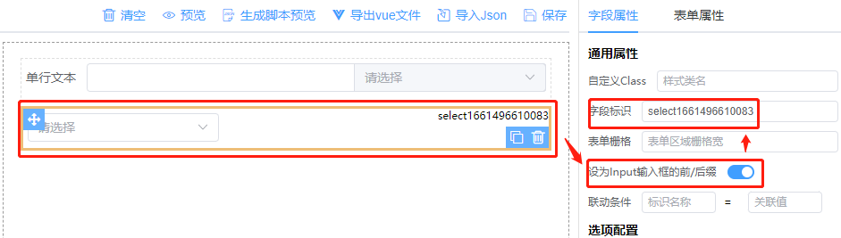
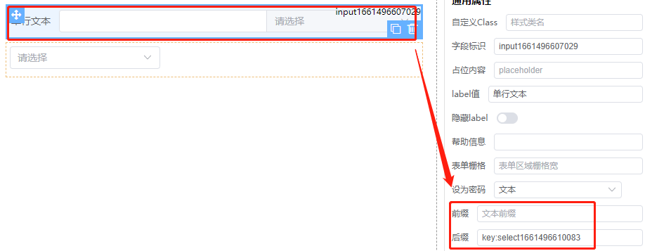

# 字段属性

字段属性会根据当前选中不同的组件显示对应的属性。每个组件显示一些常用的属性，更多属性可点击底部其他属性下方`编辑属性`按钮进行增加或编辑。

## 字段标识

表单控件唯一标识，即表单控件元素的name值。选择了数据源创建的表单，可通过接口返回的可选字段来选择，表单提交保存编辑时使用此值和对应的填写值提交表单。

## 帮助信息

用于对当前字段加以说明提示的帮助信息，会在label后面显示一个小问号，鼠标滑过提示。

## 转换格式化值

此设置主要是为了方便与接口的对接，在有些情况下对应组件输出的`v-model`为数组形式，但接口要求提交的是字符串类型，设置为`true`即可将数组转换为字符串提交。转换关系：

| 组件类型     | v-model                 | 输出结果                      | 说明    |
|----------|-------------------------|---------------------------|-------|
| checkbox | ['a','b']               | 'a,b'                     | -     |
| select   | ['a','b']/'a'           | 'a,b'/'a'                 | 适用于多选 |  
| switch   | true/false              | 1/0                       | -     |  
| cascader | ['a','b']               | 'a,b'                     | -     |  
| slider   | [10,20]/50              | '10,20',/50               | 适用于区间 |  
| table    | [{name:'a'},{name:'b'}] | '[{name:"a"},{name:"b"}]' | 子表    |  
| flex     | [{name:'a'},{name:'b'}] | '[{name:"a"},{name:"b"}]' | 弹性布局  |  

注：子表内的组件不作转换；类似于这种数据格式化转换也可以在表单提交事件`beforeSubmit`事件里处理

## 设为Input输入框的slot前后缀

可快速设置`input`输入框的`slot`前后缀为`select`下拉。

步骤：

1.选择select组件 => 设为Input输入框前/后缀为true => 复制当前字段标识，如下图



2.选择文本输入框设置前后缀为`key:粘贴前面复制的字段标识`，如下图



## 联动条件

设置了联动条件的组件，当满足条件时，设置了关联条件的组件将会根据设定的条件来显示或隐藏。
表达式如: `$.input>1` $表示为当前表单数据，input为字段标识

> 注意：区分字符串数字和纯数字

## 联动结果

根据联动条件设置的条件，当条件满足时该组件状态为`显示/隐藏`或者是`启用/禁用`，默认为`显示/隐藏`

## 校验设置

### 快速添加

本系统内置的校验规则，可快速选择然后相应填写相应的检验提示值即可，快速便捷。同时可通过可`./designForm/components/validate.ts`扩展，添加常用校验规则

### 编写校验规则

除了快速选择之外，还可以在弹出的窗口里通过编辑校验规则来实现，详情可参考UI组件的校验规则。建议使用快速添加方式

## 选项配置

适用于radio、checkbox、select、cascader选项设置，选项配置可由固定选项和动态选项组件，开发中可根据实际情况选择。使用了动态选项时建议将固定选项的默认值删除，减少不必要的代码。

### 固定选项

即可选择的值为固定值，由前端页面在设计时固定，不能修改

### 动态选项－数据源

当前组件选项通过指定的URL来获取。

可通过配置`请求附加参数`来添加指定请求参数配置，同时可使用`请求结果处理事件`编辑方法对获取到的数据进行处理，最后再`return`回去（注意：必须要return）。

当选择为数据源时，`数据源接口URL sourceFun`可带一个动态参数，如`/api?id=${key}`，其中`${key}`会被转换为数据列表中`name=key`的值。并且`name=key`
的组件中，当modelValue发生改变时会重新请求；

```javascript
const formDataList = [
  {
    name: 'select1',
    type: 'select',
    control: {modelValue: 'v1', appendToBody: true},
    ...
  },
  {
    name: 'select2',
    type: 'select',
    control: {modelValue: '', appendToBody: true},
    options: [],
    config: {
      type: 'async',
      source: 0, // 0数据源 1 方法函数 2接口字典
      request: 'get',
      beforeRequest: (data, route) => {
        data.id = route.query.id
        return data
      },
      sourceFun: '/api?id=${select1}'  // => 会查找当前数据中name=select1的组件，取modelValue的值，即/api?id=v1
    },
    item: {label: '下拉选择框', showLabel: false}
  }
]
```

### 动态选项－方法函数

该方法适合于将当前表单导出为vue文件格式，通过在页面中编写代码将选项值传给当前组件

```javascript
provide('methodsName', {label: 'x', value: 'xx'})
```

### 动态选项－接口字典

当复杂表单中存在大量需要配置选项的组件时，每个组件都从指定URL获取，这是不太现实的，一大堆的请求会让你怀疑人生不说，还浪费服务器资源。接口字典是从表单内容添加和编辑接口返回，非常方便。

需要注意：使用接口字典时，需要设置表单属性－添加时获取请为true，否则在新增内容时不会请求接口

接口返回数据规范

```json
{
  "code": 200,
  "data": {
    "dict": {
      "radio": {
        "0": "男",
        "1": "女"
      }
    }
  }
}
```

## 编辑器附件上传

可分别填写编辑图片及附件上传接口URL，也可不填写使用统一设置的

## 其他属性

字段属性里只是列了一些比较常用的prop，如还需要其他属性，可通过添加属性窗口来编写，每个组件都有不同的prop，可参考UI当前组件prop
　　

