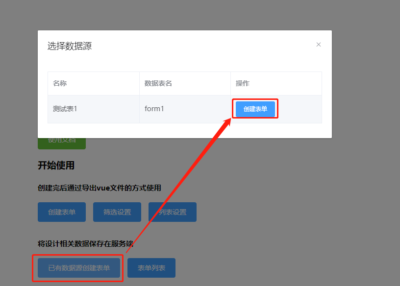

# 表单属性

## 数据源

表单和数据库表连接的桥梁，用于表单数据增加及修改时提交到后端指定的数据表中。如选择了无数据源创建表单，可通过这里修改

## 表单名称

设计生成的表单名称 

## 提交/返回按钮

用于提交表单数据按钮，为空时需要在导出vue文件里添加提交按钮；返回按钮默认事件为$route.go(-1)

## 添加时获取请求

开启后在新增表单内容时，可从接口处获取一些默认的值；可统一为表单里的单选、多选、下拉选择组件提供options数据字典，减少这类组件单独请求获取options，从而减少请求。默认情况下表单新增内容时不请求接口

## 编辑表单样式

可在弹出的窗口里编写css样式，相当于vue页面的style scope，会在当前表单页加载完成时插入到页面中

　　

