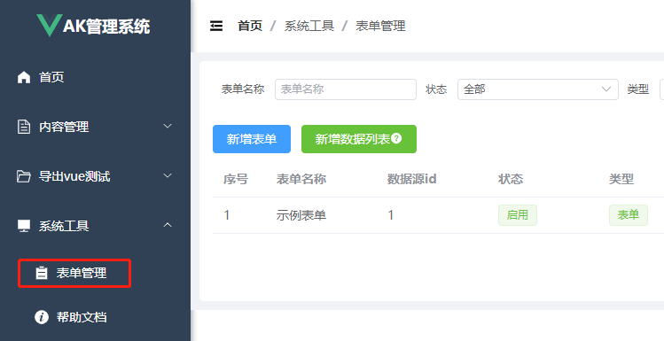
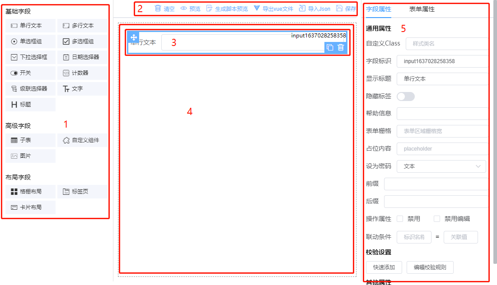
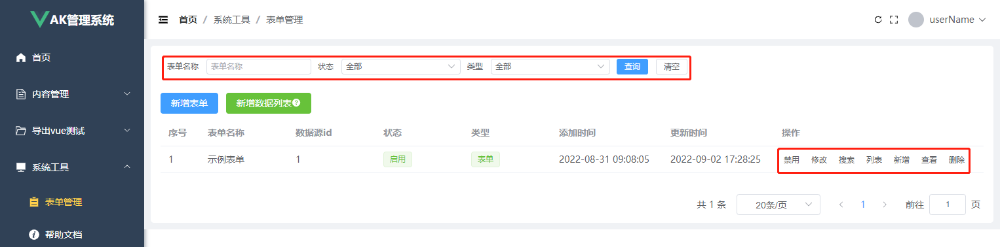
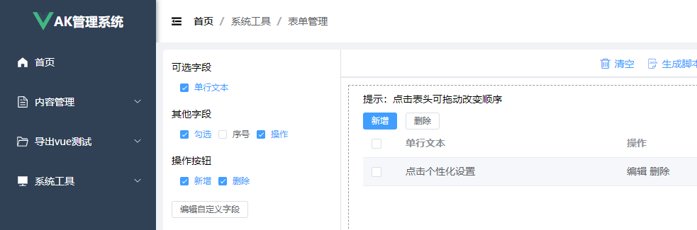
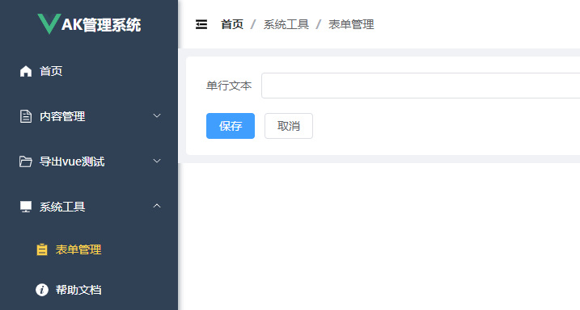

<!-- Created by 337547038 使用手册 -->
# 页面介绍

## 创建表单流程

1.从系统工具/表单管理进入页面，根据需求选择新增表单或新增数据列表进入创建页面；

2.从左则（红框1）拖动组件到设计区域，根据需求配置在区域5中配置好当前组件相关属性。最后将设计好的表单保存到服务端或导出vue文件。

【1】设计器字段区域

【2】设计器按钮操作区域

【3】组件布局（复制、删除、拖动）

【4】设计器编辑区域

【5】设计器属性配置面板

3.保存成功后将跳转到已设计表单管理页

3.1 修改：对已设计好的表单进行修改；

3.2 搜索：对列表设置条件筛选设置，类似于表单设计页，设计好后保存

3.3 列表：对数据列表进行设置，类似于表单设计，从左侧栏勾选可选字段或编辑自定义字段完成列表设置，设计好后保存

3.4 新增：内容新增页面，点击会跳转到前面设计好的表单新增页，进行数据添加操作

3.5 查看：进入表单列表页；

如上图：区域1显示的为筛选表单3.2的设置；区域2可继续添加或批量删除内容数据；区域3为3.3设置的数据列表；区域4可对当前记录进行编辑或删除操作

3.6 删除：删除设计好的表单

整个表单设计、列表设置、筛选设置、内容增加、内容列表等操作完成！

