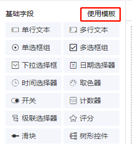

# 使用模板

可通用使用模板快速创建表单



## 创建新模板

`src/views/designForm/template`目录下新建ts文件，将设计生成的`json/javascript`代码复制保存即可新增模板，格式如下：

```javascript
export const imgPath = 'demo.png' // 预览图
export const title = '标题' // 标题
export const formData = {} // 生成的代码
```
