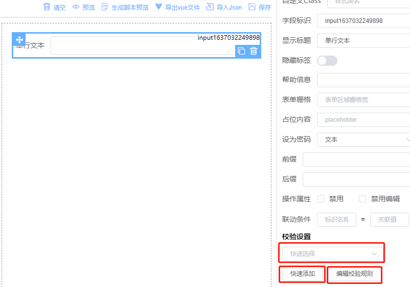
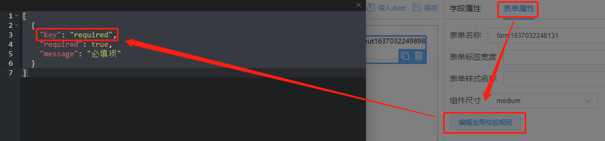

<!-- Created by 337547038 使用手册-表单校验 -->

# 表单校验

提供了三种表单检验规则填写方式

## 快速选择

从当前表单全局校验规则里选择添加，适用于多个表单控件使用同一个规则时。使用前需要先从表单属性里添加全局校验规则（如图）。每个对象里的key是必须且唯一的，其他所有参数同UI组件的校验规则。

## 　快速添加

内置了常用的校验规则正则和自定义方法，自定义方法的使用可以参数示例

## 　编辑校验规则

所有参数同UI组件的校验规则

　　

